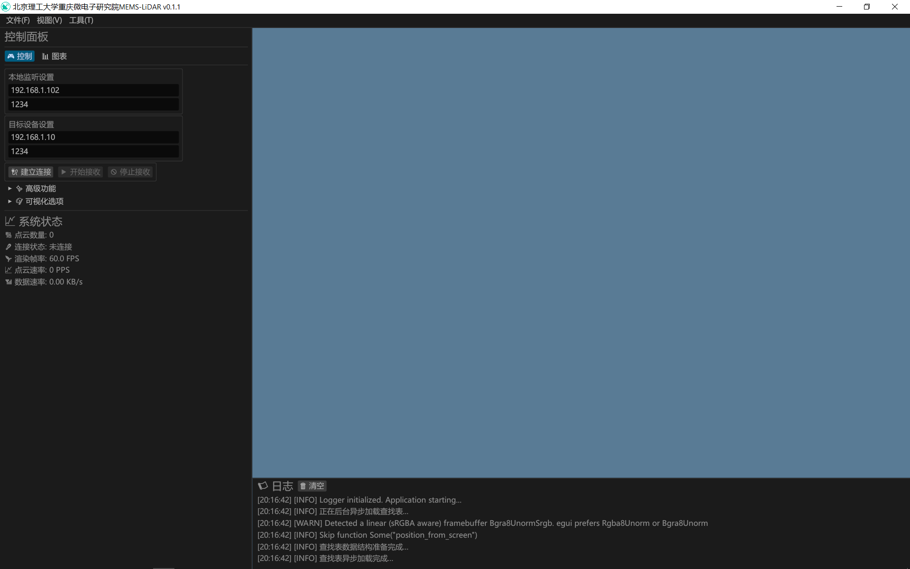

# MEMS-LiDAR 实时 3D 点云上位机 v0.1.1

**English:** MEMS LiDAR Real-time 3D Point Cloud Visualizer

这是一款为 MEMS-LiDAR 设计的实时三维点云数据显示、处理与分析的上位机软件，由**北京理工大学重庆微电子研究院**开发。本软件采用 Rust 语言编写，利用 wgpu 实现了高性能的跨平台 3D 渲染。



---

## ✨ 功能特点

* **实时数据显示**: 通过 UDP 协议实时接收 LiDAR 原始数据包，并高效处理成三维点云。
* **高性能 3D 渲染**: 基于 `wgpu` (WebGPU API 的 Rust 实现)，使用公告板(Billboarding)技术渲染大规模点云，保证流畅的交互体验。
* **交互式相机控制**: 支持自由的轨道式旋转、平移和缩放，方便从任意角度观察点云。
* **多种着色模式**:
    * **纯白模式**: 突出点云的几何结构。
    * **按深度着色**: 根据点在 Z 轴上的位置（高度/深度）进行颜色映射，增强立体感。
* **数据分析与图表**:
    * 实时显示距离数据波形图。
    * 实时显示距离数据直方图，分析距离分布。
* **测量工具**: 提供简单的交互式测距工具，可在 3D 视图中拾取两点并计算它们之间的直线距离。
* **数据管理**:
    * 支持**保存**当前点云到 `.xyz` 格式文件。
    * 支持从 `.xyz` 文件**加载**点云进行离线分析。
    * 提供清空、重置视角等管理功能。
* **完善的图形用户界面 (GUI)**:
    * 使用 `egui` 构建，包含菜单栏、控制面板、状态显示和日志窗口。
    * 网络参数、渲染参数（如点云大小）均可动态调整。
* **单文件分发**: 通过编译脚本将图标等资源直接嵌入到最终的 `.exe` 可执行文件中，无需依赖外部文件，方便部署。

---

## 🛠️ 技术栈

* **编程语言**: [Rust](https://www.rust-lang.org/)
* **图形 API**: [wgpu](https://github.com/gfx-rs/wgpu) (跨平台图形接口, 对标 Vulkan/Metal/DirectX12)
* **窗口与事件**: [winit](https://github.com/rust-windowing/winit)
* **图形用户界面 (GUI)**: [egui](https://github.com/emilk/egui)
* **异步运行时**: [tokio](https://tokio.rs/) (用于处理网络通信)
* **并行计算**: [rayon](https://github.com/rayon-rs/rayon) (用于并行化点云数据处理)
* **数学库**: [glam](https://github.com/bitshifter/glam) (用于向量和矩阵运算)
* **Excel 解析**: [calamine](https://github.com/tafia/calamine) (用于加载查找表)
* **Windows 资源编译**: [winres](https://github.com/mxre/winres) (用于嵌入 `.exe` 图标)

---

## 🚀 编译与运行

### 1. 环境准备

* **安装 Rust**: 请通过 [rustup](https://rustup.rs/) 安装最新的 Rust 稳定版工具链。
    ```bash
    rustup-init
    ```
* **Windows**: 需要安装 C++ Build Tools，可以在安装 Visual Studio 时选择此组件。
* **Linux**: 需要安装 `build-essential`, `libxcb-shape0-dev`, `libxcb-xfixes0-dev` 等 `winit` 的依赖项。

### 2. 项目配置

1.  **克隆仓库**:
    ```bash
    git clone git@github.com:wuxiangchao/lidar-native.git
    cd git@github.com:wuxiangchao/lidar-native.git
    ```
2.  **放置查找表**: 将 MEMS 振镜的电压-角度查找表 Excel 文件 `MEMS_Voltage_9.18-2.xlsx` 放置于项目根目录下的 `data/` 文件夹中。
3.  **放置图标**:
    * 将可执行文件图标 `icon.ico` 放置于项目**根目录**。
    * 将窗口图标 `icon.png` 放置于 `assets/` 文件夹中。

### 3. 运行

* **调试模式运行**:
    ```bash
    cargo run
    ```
* **发布模式编译**: (生成优化的可执行文件)
    ```bash
    cargo build --release
    ```
  生成的可执行文件位于 `target/release/lidar-native.exe`。

---

## 📂 项目结构

```
.
├── data/           # 存放数据文件，如查找表
├── assets/         # 存放字体，图标文件
├── shaders/        # WGSL 着色器代码
├── src/
│   ├── app.rs      # 核心应用逻辑与状态管理
│   ├── camera.rs   # 3D 相机控制器
│   ├── common.rs   # 通用数据结构定义 (如 Point)
│   ├── logger.rs   # 自定义日志系统
│   ├── main.rs     # 程序入口与 winit 事件循环
│   ├── network.rs  # UDP 网络通信
│   ├── processing.rs # 原始数据处理与点云转换
│   ├── renderer.rs # wgpu 渲染引擎
│   ├── ui.rs       # egui 用户界面绘制
│   └── utils.rs    # 工具函数
├── build.rs        # 编译脚本 (用于嵌入图标)
├── Cargo.toml      # 项目依赖与配置
└── README.md       # 本文档
```

---

## 📝 未来规划

* [ ] **原始数据录制与回放**: 支持将实时 UDP 数据流录制为文件，并能离线回放，方便调试与演示。
* [ ] **点云滤波功能**: 增加统计离群点移除 (SOR) 等滤波算法，优化点云质量。
* [ ] **渲染效果增强**: 探索眼穹顶光照 (EDL) 等技术，提升点云的视觉表现力。
* [ ] **导出更多格式**: 增加对 `.pcd`、`.ply` 等标准点云格式的导出支持。

---

## 📜 许可 (License)

本项目采用 [MIT License](LICENSE-MIT) 或 [Apache License 2.0](LICENSE-APACHE) 授权。